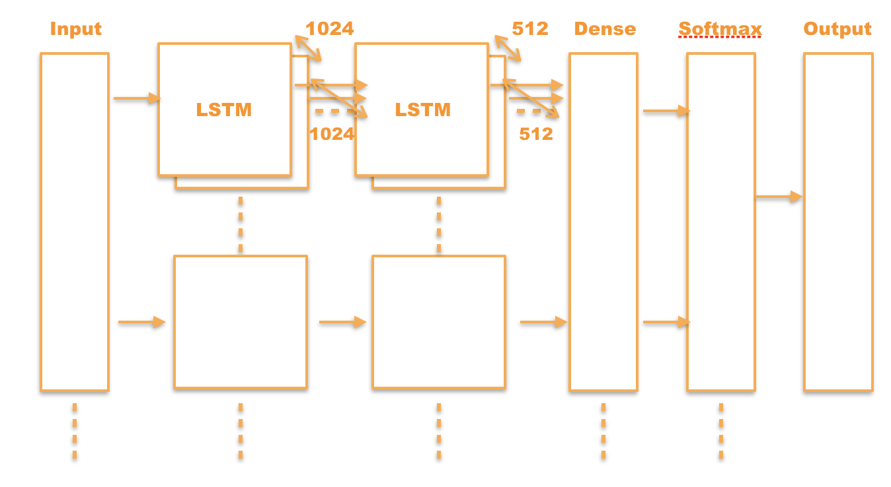
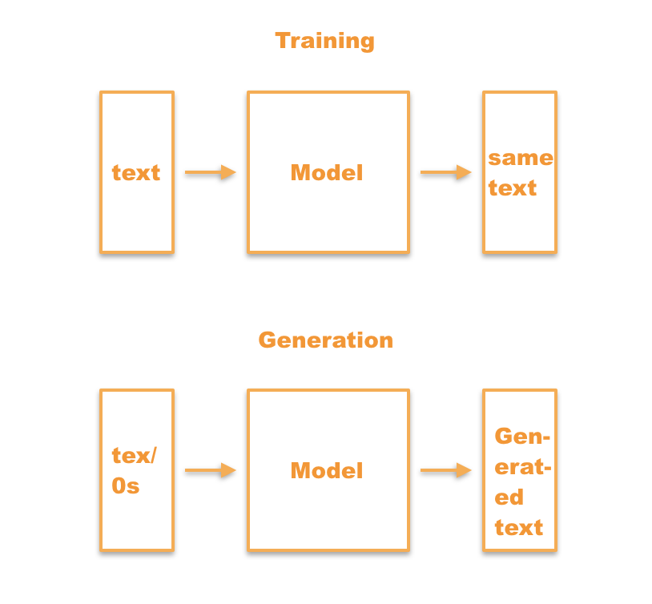

## Training a Deep Learning Language Model Using Keras and Tensorflow
_A Code Pattern focusing on how to train a machine learning language model while using Keras and Tensorflow._

This Code Pattern will guide you through installing Keras and Tensorflow, downloading data of Yelp reviews and training a language model using recurrent neural networks, or RNNs, to generate text.

Using deep learning to generate information is a hot area of research and experimentation. In particular, the RNN deep learning model approach has seemingly boundless amounts of areas it can be applied to, whether it be to solutions to current problems or applications in budding future technologies. One of these areas of application is text generation, which is what this Code Pattern introduces. Text generation is used in language translation, machine translation and spell correction. These are all created through something called a language model. This Code Pattern runs through exactly that: a language model using an long short term memory (LSTM) RNN. For some context, RNNs use networks with hidden layers of memory to predict the next step using the highest probability. Unlike Convolutional Neural Networks (CNNs) which use forward propagation, or rather, move forward through its pipeline, RNNs utilize backpropogation, or circling back through the pipeline to make use of the "memory" mentioned above. By doing this, RNNs can use the text inputed to learn how to generate the next letters or characters as its output. The output then goes on to form a word, which eventually ends up as a collection of words, or sentences and paragraphs. The LSTM part of the model allows you to build an even bigger RNN model with improved learning of long-term dependencies, or better memory. This means an improved performance for those words and sentences we're generating!

This model is relevant as text generation is increasingly in demand to solve translation, spell and review problems across several industries. In particular, fighting fake reviews plays a big role in this area of research. Fake reviews are a very real problem for companies such as Amazon and Yelp, who rely on genuine reviews from users to vouch for their products and businesses which are featured on their sites. As of writing this, it is very easy for businesses to pay for fake, positive reviews, which ultimately end up elevating their sales and revenue. It is equally as easy to generate negative reviews for competing businesses. Unfortunately this leads users to places and products fradulently and can potentially lead to someone having a negative experience or worse. In order to combat these abuses and illegal activity, text generation can be used to detect what a review looks like when it is generated versus a genuine review written by an authentic user. This Code Pattern walks you how do create this text generation at a high level. We will run through how to approach the problem with a small portion of Yelp review data, but afterwards you can apply it to a much larger set and test what output you get!

The original yelp data used in this Code Pattern can be found [here](https://www.kaggle.com/c/yelp-recruiting/data) as well as in this repository under [data/](https://github.com/MadisonJMyers/Training-a-Deep-Learning-Language-Model-Using-Keras-and-Tensorflow/tree/master/data). 

### But what is Keras and Tensorflow?

If you've clicked on this Code Pattern I imagine you range from a deep learning intermediate to a beginner who's interested in learning more. Wherever you are on the spectrum, you probably think machine learning and deep learning are awesome (which I agree with) and have probably been exposed to some examples and terminology. You probably also understand some python and the fact that deep learning is a subset of machine learning (which is a subset of artifical intelligence as a whole). With those assumptions in mind, I can explain that Tensorflow is an open-source software library for machine learning, which allows you to keep track of all of your models and also see them with cool visualizations. 

Keras is a deep learning library that you can use in conjunction with Tensorflow and several other deep learning libraries. Keras is very user-friendly in that it allows you to complete a model (for example using RNNs) with very few lines of code, which makes every data scientist's (including myself) life much easier! This project highlights exactly that feature with its relatively small amount of code. Keras also allows you to switch between libraries depending on what you're trying to do, saving you a great deal of headache and time. Let's get started shall we?


## Flow

1. Download and install Keras, Tensorflow and their prerequisites.
2. Download the yelp data. This example will use the [yelp_100_3.txt](https://github.com/MadisonJMyers/Training-a-Deep-Learning-Language-Model-Using-Keras-and-Tensorflow/blob/master/data/yelp_100_3.txt), but once you feel familiar enough you can apply it to the entire [kaggle dataset](https://www.kaggle.com/c/yelp-recruiting/data).
3. Download the all of the files in the [code folder](https://github.com/MadisonJMyers/Training-a-Deep-Learning-Language-Model-Using-Keras-and-Tensorflow/tree/master/code) (make sure the data and the files are in the same folder).
4. Train a language model to generate text and run it.
5. Analyze the result.

## Included components

* [Keras](https://keras.io/): The Python Deep Learning library.
* [Tensorflow](https://www.tensorflow.org/): An open-source software library for Machine Intelligence.

## Featured technologies

* [Cloud](https://www.ibm.com/developerworks/learn/cloud/): Accessing computer and information technology resources through the Internet.
* [Data Science](https://medium.com/ibm-data-science-experience/): Systems and scientific methods to analyze structured and unstructured data in order to extract knowledge and insights.
* [Python](https://www.python.org/): Python is a programming language that lets you work more quickly and integrate your systems more effectively.

# Watch the Video
Coming Soon!


# Prerequisites
    
1. Have python 3.0 or above installed.

2. Have required libraries installed. 

    * pip.
      For a mac pip comes installed when you install python. Example:
      ```
      brew install python
      ```
      Otherwise you can try:
      ```
      sudo easy install pip
      ```
    * NumPy and SciPy. Once pip is installed. You can use it to install NumPy and SciPy (and gfortran which is needed to compile SciPy):
      ```
      pip install numpy
      brew install gfortran
      pip install scipy
      ```
    * Pandas.
      ```
      pip install pandas
      ```
    * zipfile. For python 3.6:
      ```
      pip install zipfile36
      ```


# Steps

This pattern runs through the steps below. Check out the notebook for the code!


1. Download and install Keras and Tensorflow.

* Install Tensorflow. 
    Go [here](https://www.tensorflow.org/install/) to follow the directions if you are not on a MacOS.
    For Mac users, ```pip install tensorflow-gpu``` will install the gpu version, which is what I used on my server.
* Install Keras. 
    You can go to [this](https://keras.io/#getting-started-30-seconds-to-keras) link. 
    You can also just:
    
        ```
        pip install keras
        ```
        
    Or you can use git:
    
        ``` 
        git clone https://github.com/fchollet/keras.git
        cd keras
        sudo python setup.py install 
        ```


2. Download the yelp data. 

* This example will use the [yelp_100_3.txt](https://github.com/MadisonJMyers/Training-a-Deep-Learning-Language-Model-Using-Keras-and-Tensorflow/blob/master/data/yelp_100_3.txt), but once you feel familiar enough you can apply it to the entire [kaggle dataset](https://www.kaggle.com/c/yelp-recruiting/data).

What this data allows us to do is consider authentic yelp reviews and use them as an input to our language model. That means our model will iterate over the reviews given to generate similar yelp reviews. If a different dataset was used, like a novel by Hemingway, we would then generate text that was similar stylistically to Hemingway.
    
  

3. Download the code. 

* Find the code files in the [code folder](https://github.com/MadisonJMyers/Training-a-Deep-Learning-Language-Model-Using-Keras-and-Tensorflow/tree/master/code). Make sure you download the data and the code files in the same folder. You need to also download the weights from [here](https://ibm.box.com/s/0ry6m3t68ygdi1dom8boko2h5wlywsr8) into the exact same folder you have the code and the data.

What we're doing here is defining what characters and punctuation are so that we can form correct words and sentences and consider certain factors and their relevance to the English language. The weights on the other hand are what allow us to fine tune the model and adjust for accuracy. You won't have to worry about adjusting the weights here but the output will be saved into the weight file that you download from the link provided.
    
4. Train a model.

* Make sure you collect all of the files that you downloaded into the same folder. 
* Then run transfer_learn.py.

    ```
    python transfer_learn.py
    ```

* Push enter.
* Once you've executed you should see tensorflow start up and then various epochs running on your screen followed by generated text with increasing diversities.

To help understand what's going on here, in the file transfer_learn.py we use a keras sequential model of the LSTM variety, mentioned earlier. We use this variety so that we can include hidden layers of memory to generate more accurate text. Here the maxlen is automatically set to none. The maxlen refers to the maximum length of the sequence and can be none or an integer. We then use the Adam optimizer with categorical_crossentropy and begin by loading our transfer_weights. We define the sample with a temperature of 0.6. The temperature here is a parameter than can be used in the softmax function which controls the level of newness generated where 1 constricts sampling and leads to less diverse/more repetitive text and 0 has completely diverse text. In this case we are leaning slightly more towards repetition, though, in this particular model, we generate multiple versions of this with a sliding scale of diversities which we can compare to one another and see which works best for us. You'll also see the use of enumerate in the transfer_learn.py which ultimately allows us to create an automatic counter and loop over information. We then train the model and save our weights into transfer_weights, which can be found in this repo. Every time you train the model, you will save your learned weights to help improve the accuracy of your text generation. 



As you can see in the diagram above, the inputed text is sent through several layers of the LSTM model (forward and backward) and then sent through a dense layer followed by a softmax layer. This considers information and iterates over the data at a character level. This means it considers context such as the previous characters to determine the next characters, ultimately forming words and then sentences to generate an entire review. 



4. Analyze the result.

As you can see in the image below, you should expect to see text being generated with different diversities and then saved back into the weights. By this output you can see what different outputs are based on different diversities of text (more diverse vs less/more repetitive).


Congrats! Now you've learned how to generate text based on the data you've given it. Now you can challenge yourself by trying out the entire yelp dataset or other text data! You got this!

# Links

* [Create Data Science Experience Notebooks](https://datascience.ibm.com/docs/content/analyze-data/creating-notebooks.html)
* [Jupyter Notebook](http://jupyter.org/): An open source web application that allows you to create and share documents that contain live code, equations, visualizations, and explanatory text.
* [Keras](https://keras.io/): The Python Deep Learning library.
* [Tensorflow](https://www.tensorflow.org/): An open-source software library for Machine Intelligence.


# Learn more

* **Data Analytics Code Patterns**: Enjoyed this Code Pattern? Check out our other [Data Analytics Code Patterns](https://developer.ibm.com/code/technologies/data-science/)
* **AI and Data Code Pattern Playlist**: Bookmark our [playlist](https://www.youtube.com/playlist?list=PLzUbsvIyrNfknNewObx5N7uGZ5FKH0Fde) with all of our Code Pattern videos
* **Data Science Experience**: Master the art of data science with IBM's [Data Science Experience](https://datascience.ibm.com/)
* **Spark on IBM Cloud**: Need a Spark cluster? Create up to 30 Spark executors on IBM Cloud with our [Spark service](https://console.bluemix.net/catalog/services/apache-spark)

# License
[Apache 2.0](LICENSE)
